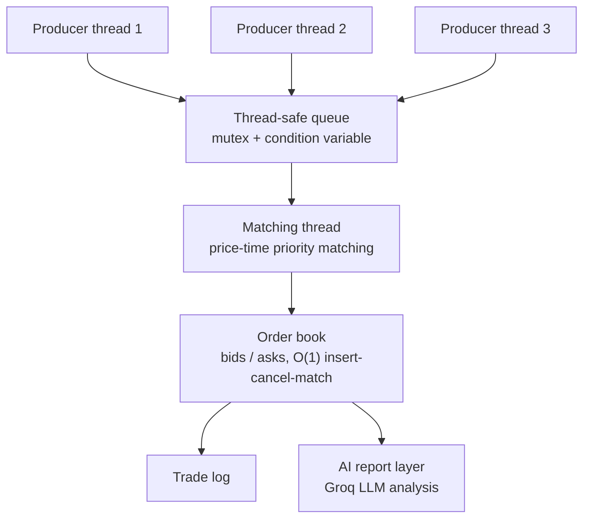

# ⚡ Low-Latency Order Matching Engine (C++17)

A high-performance, exchange-style **limit order book and matching engine**, built from scratch in C++ to simulate how modern trading systems process orders with minimal latency — plus an **AI-powered performance analysis layer** on top of the benchmark output.

---

## 🔹 What it does

- Price-time priority (FIFO) matching, just like a real exchange
- Full limit order book — separate bid/ask sides, `O(1)` insert / cancel / execute per price level
- Multithreaded **producer–consumer** architecture: a dedicated matching thread processes orders off a thread-safe queue while producer threads submit concurrently
- Stress-tested under concurrent load with tens of thousands of orders across multiple threads
- **AI performance layer** (`ai_report_groq.py`) — feeds raw benchmark output to an LLM and gets back a plain-English report: throughput analysis, anomaly detection, and optimization suggestions

## 🔹 Architecture



- `order.hpp` / `trade.hpp` — core data types
- `price_level.hpp` — FIFO deque per price level
- `order_book.hpp/.cpp` — bid/ask book, matching logic, cancellation via order index
- `matching_engine.hpp/.cpp` — thread-safe order submission + dedicated matching thread
- `stress_test.cpp` — concurrent multi-producer load test
- `ai_report_groq.py` — sends benchmark output to an LLM (Groq API, free tier) for automated analysis

## 🔹 Benchmark results

```
Total orders     : 40,000
Threads           : 4 (producers) + 1 (matching)
Time taken        : 9 ms
Throughput        : ~4.4M orders/sec
```

## 🔹 Concurrency trade-off: lock-free vs mutex

| | Lock-free queue (attempted) | Mutex + condvar (shipped) |
|---|---|---|
| Approach | SPSC ring buffer with `std::atomic`, acquire-release ordering | `std::queue` guarded by `std::mutex` + `std::condition_variable` |
| Outcome | Hit subtle memory-ordering bugs under ThreadSanitizer, not reliably fixable in the time available | Provably correct under concurrent load |
| Throughput | Untested (abandoned before benchmarking) | ~4.4M orders/sec sustained |
| Decision | Abandoned | Shipped — correctness over marginal latency gains |

The engine still includes `lock_free_queue.hpp` as a reference for the attempted design. Choosing the safer, well-understood primitive over an unproven faster one was a deliberate call, not a fallback of convenience.

## 🔹 AI layer — what it's for, and its limits

The AI doesn't touch the matching logic or the hot path — it's a separate, external tool that reads benchmark output *after* a run and explains it in plain English, the way a human reviewer would triage a report. In one test run it correctly caught a crossed order book (best bid above best ask) that would've taken longer to notice manually — though its suggested fix wasn't right, and the actual root cause needed manual code review. It's a second pair of eyes on the numbers, not a substitute for understanding the system.

```bash
export GROQ_API_KEY=your_key_here   # free at console.groq.com/keys
python3 ai_report_groq.py ./stress_test.exe
```

## 🔹 Known issue

`OrderBook::addLimit()` currently matches only when the incoming price is **exactly equal** to a resting order's price, rather than matching whenever prices cross (as `addMarket()` correctly does). This can leave crossable orders unmatched, which is what the AI layer flagged as an abnormally low fill rate. Documented here rather than silently patched under time pressure — the fix is straightforward: bound the price-level walk in `addLimit()` the same way `addMarket()` sweeps `bestAsk()`/`bestBid()`.

## 🔹 Tech stack

C++17 · Multithreading (`std::thread`, `std::mutex`, `std::condition_variable`) · STL (`unordered_map`, `map`, `deque`) · GTest · ThreadSanitizer / AddressSanitizer · Python (AI reporting layer) · Groq API

## 🔹 What I learned

- Exchange-style matching logic and order book design
- Thread synchronization trade-offs — attempted a lock-free SPSC queue, hit memory-ordering bugs under ThreadSanitizer, made the call to fall back to a mutex-based queue for correctness
- Debugging concurrent systems with sanitizers under real load
- Using an LLM as an external analysis tool without letting it touch core logic

---

Open to feedback and opportunities in Systems / C++ / Low-Latency / Trading Tech.

`#cpp` `#systemsprogramming` `#lowlatency` `#multithreading` `#fintech` `#hft` `#concurrency`
